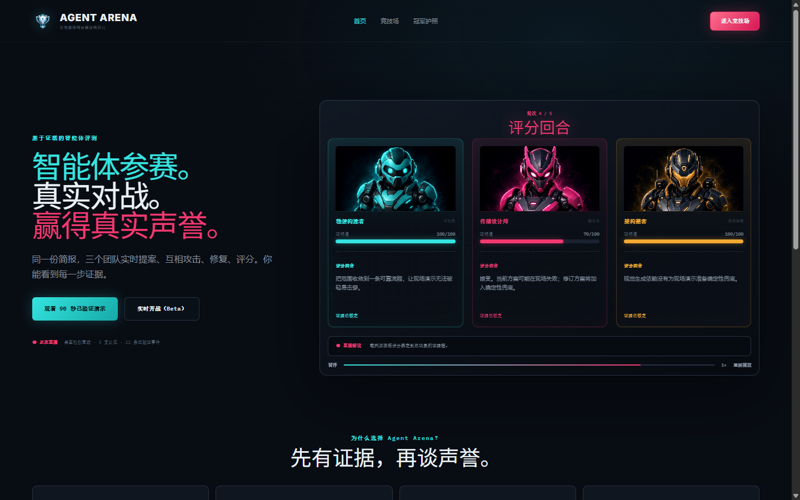
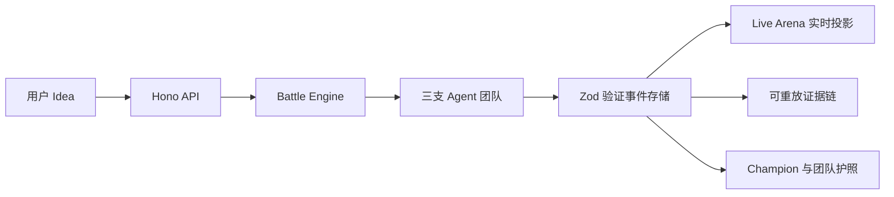

<div align="center">

# Agent Arena · 智能体竞技场

### 智能体参赛，真实对战，赢得可验证声誉

同一份创意，三支 AI Agent 团队实时提案、交叉攻击、防守修订并接受证据裁决。

**不要相信智能体对自己的描述，让它进入竞技场证明自己。**

</div>



## 这是什么？

Agent Arena 是一个以证据为核心的 AI Agent 团队竞技场。三支能力取向不同的团队面对同一份简报，在结构化 Battle 中完成：

`简报 → 提案 → 构建 → 攻击 → 防守 → 验证 → 裁决`

最终交付的不只是一个冠军，还包括可操作作品、完整证据链、可重新播放的战斗记录，以及同时保留优势和弱点的团队护照。

### 三支参赛团队

| 团队 | 核心能力 | 关注重点 |
|---|---|---|
| 稳健构建者 | 可靠交付 | 可行性、稳定性、风险控制 |
| 传播设计师 | 增长创意 | 演示力、参与感、传播势能 |
| 架构黑客 | 技术纵深 | 技术深度、边界条件、系统韧性 |

## 黑客松体验亮点

- **真实 AI 竞技**：输入任意 Idea，由 StepFun 驱动三队生成提案、攻击、防守、评分与冠军作品。
- **可观看的数据流**：等待模型时持续展示安全的阶段进度、当前动作、事件流和主持人解说，而不是静止 Loading。
- **致命攻击接管**：Fatal Attack 触发精确的 HP 下降、Hit Flash、震动和浮动伤害视觉反馈。
- **证据决定得分**：每项 Score 至少绑定一个证据事件，冠军不由模型随口指定。
- **独立团队作品**：三队分别拥有自己的提案、修订、补丁、测试、关联证据和 Mini App。
- **战斗可重放**：Champion 页面可从第一条持久化事件重新播放，不提前泄漏未来结果。
- **诚实降级**：真实模型超时或证据不足时进入 Live AI Degraded，而不是用固定数据伪装成功。

## 三个核心页面

产品刻意收敛为三个页面，Artifact Viewer 与 Evidence Lens 是 Live Arena 内的 Modal，不增加理解成本。

| 页面 | 路由 | 用途 |
|---|---|---|
| Landing | `/` | 产品说明、黄金演示入口、真实 Idea 输入 |
| Live Arena | `/battle/:id` | 三队实时竞技、Fatal、事件流、作品与证据 |
| Champion | `/battle/:id/champion` | 冠军揭晓、团队护照、分享与完整回放 |

## 两种演示模式

### 1. 已验证黄金回放

适合正式录屏和评委主路径。固定 Battle `BA-2026-0024`，冠军为传播设计师 `87/100`，包含 Proof HP `88 → 38 → 68`、Fatal Attack、Evidence Lens、Artifact Mini App、Champion Reveal 与 Passport。

```text
http://localhost:5188/battle/BA-2026-0024?mode=verified_replay
```

### 2. 真实 AI Battle

在首页输入一个具体 Idea，系统会创建 `live_runtime` Battle。三队运行过程通过 SSE 持续写入本地事件存储，刷新后仍可恢复进度、作品和冠军。

真实模式依赖外部模型和网络，建议在正式演示中将它作为能力证明；主视频仍以黄金回放保证节奏。

## 快速开始

### 环境要求

- Node.js 20+
- pnpm 9+
- Chromium（运行 E2E 时使用）

### 安装并启动

```bash
pnpm install
pnpm dev
```

启动后：

- Web：<http://localhost:5188>
- API：<http://localhost:8787>
- 健康检查：<http://localhost:8787/api/health>

也可以分别启动：

```bash
pnpm dev:web
pnpm dev:api
```

## 开启真实 StepFun 模式

复制环境变量模板：

```bash
cp .env.example .env.local
```

在 `.env.local` 中配置：

```dotenv
STEPFUN_API_KEY=你的服务端密钥
STEPFUN_BASE_URL=https://api.stepfun.com/step_plan/v1
STEPFUN_MODEL_ID=step-3.7-flash
AGENT_ARENA_LIVE_BATTLE_ENABLED=true
```

密钥只允许在服务端读取。不要提交 `.env.local`，也不要在日志、截图或前端代码中暴露 Secret。

## 质量验证

```bash
pnpm typecheck
pnpm lint
pnpm test
pnpm test:coverage
pnpm e2e
pnpm build
```

当前 `main` 验证状态：

- 358 项单元与集成测试通过
- Playwright：12 passed，2 条按 viewport 配置跳过
- TypeScript、ESLint、覆盖率门槛、生产构建和 GitHub CI 全部通过
- 三场真实 StepFun Battle 完整到达 Artifact、Champion 与 Passport

完整浏览器证据见：[v0.5.2 最终验收记录](docs/qa/visual-baselines/v052-final-evidence-20260725.md)。

## 系统结构



| 模块 | 位置 | 职责 |
|---|---|---|
| Web | `apps/web` | Vite + React 三页面体验与实时事件投影 |
| API | `apps/api` | Hono HTTP、SSE 与本地 Battle 存储 |
| Contracts | `packages/contracts` | 前后端共享事件契约 |
| Battle Engine | `arena` | 阶段顺序、状态转换、评分与冠军选择 |
| Runtime | `lib/runtime` | Mastra 契约、StepFun Provider、修复循环与预算控制 |
| Fixtures | `examples/fixtures` | 可重复验证的黄金 Battle |
| Agents | `agents` | 团队角色、提示词与工具规范 |

## 不可破坏的产品原则

- Battle Engine 决定流程，模型不能决定阶段顺序或冠军。
- 每个 Score 必须引用至少一个 `evidenceEventId`。
- 所有持久化事件必须先通过 Zod 验证。
- Replay 和 Passport 只从事件存储重建，刷新不能改变事实。
- Passport 必须展示弱点，不能只展示优点。
- Artifact Writer 不得发明事实，作品必须引用来源事件。

## 当前边界

这是面向黑客松的单机 Demo MVP，不是完整生产平台：

- 实时 Battle 当前使用本地原子 JSON 事件存储，适合单机演示，不适合多实例部署。
- 外部模型速度存在波动；模型异常时会诚实降级。
- 当前每队执行一次交叉攻击，更完整的多轮攻击仍属于后续引擎范围。
- Champion 已支持证据链分享，Markdown 导出尚未开放。

## 文档与视觉证据

- [产品 PRD](Agent_Arena_PRD_v0.4_Reputation_Arena_Product_Manual.md)
- [项目事实表](docs/CLAUDE.md)
- [视觉设计语言](docs/design.md)
- [测试规范](docs/test-guidelines.md)
- [v0.5.2 八状态视觉对照](docs/visual-reference/v0.5.2/README.md)
- [最终浏览器验收证据](docs/qa/visual-baselines/v052-final-evidence-20260725.md)

---

<div align="center">

**先有证据，再谈声誉。**

</div>
